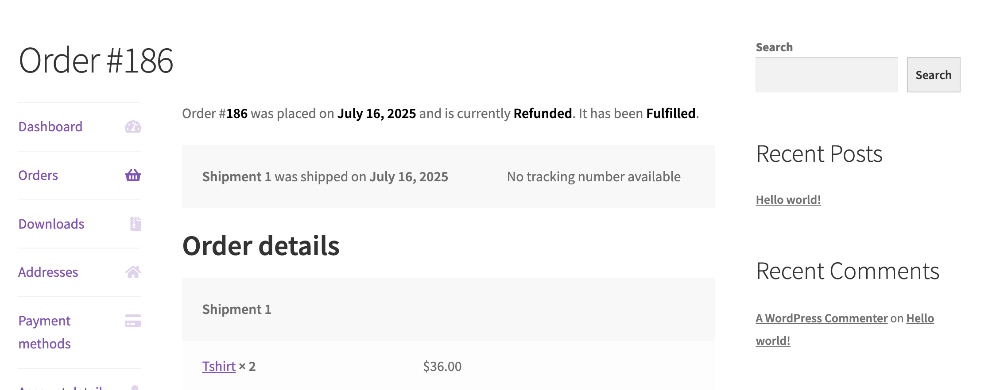

# WooCommerce Order Fulfillments - Complete Hooks Reference

This document provides a comprehensive reference for all action hooks and filter hooks available in the WooCommerce Order Fulfillments system.

## Action Hooks

Action hooks allow you to execute custom code at specific points in the fulfillment lifecycle without modifying the return value.

### Data Lifecycle Actions

#### `woocommerce_fulfillment_after_create`

Fired after a fulfillment is successfully created in the database.

**File:** `src/Internal/DataStores/Fulfillments/FulfillmentsDataStore.php:122`

**Parameters:**

-   `$data` (Fulfillment) - The created fulfillment object

**Purpose:** Allows plugins to perform actions after a fulfillment is created, such as updating order fulfillment status, syncing to external systems, or logging.

```php
add_action( 'woocommerce_fulfillment_after_create', 'log_fulfillment_creation' );

function log_fulfillment_creation( $fulfillment ) {
    error_log( 'Fulfillment created: ' . $fulfillment->get_id() );
}
```

#### `woocommerce_fulfillment_after_fulfill`

Fired after a fulfillment is marked as fulfilled (both during create and update operations).

**File:** `src/Internal/DataStores/Fulfillments/FulfillmentsDataStore.php:131` and `273`

**Parameters:**

-   `$data` (Fulfillment) - The fulfilled fulfillment object

**Purpose:** Triggered when a fulfillment transitions to fulfilled status, useful for inventory updates or external system notifications.

```php
add_action( 'woocommerce_fulfillment_after_fulfill', 'update_inventory_system' );

function update_inventory_system( $fulfillment ) {
    $items = $fulfillment->get_meta( '_items', true );
    // Update external inventory system
}
```

#### `woocommerce_fulfillment_after_update`

Fired after a fulfillment is successfully updated in the database.

**File:** `src/Internal/DataStores/Fulfillments/FulfillmentsDataStore.php:262`

**Parameters:**

-   `$data` (Fulfillment) - The updated fulfillment object

**Purpose:** Allows plugins to perform actions after a fulfillment is updated.

```php
add_action( 'woocommerce_fulfillment_after_update', 'sync_fulfillment_changes' );

function sync_fulfillment_changes( $fulfillment ) {
    // Sync changes to external fulfillment service
}
```

#### `woocommerce_fulfillment_after_delete`

Fired after a fulfillment is soft-deleted from the database.

**File:** `src/Internal/DataStores/Fulfillments/FulfillmentsDataStore.php:331`

**Parameters:**

-   `$data` (Fulfillment) - The deleted fulfillment object

**Purpose:** Allows plugins to perform cleanup actions after a fulfillment is deleted.

```php
add_action( 'woocommerce_fulfillment_after_delete', 'cleanup_fulfillment_data' );

function cleanup_fulfillment_data( $fulfillment ) {
    // Clean up related data or notify external systems
}
```

### Customer Notification Actions

#### `woocommerce_fulfillment_created_notification`

Fired when customer notification should be sent for a new fulfilled fulfillment. This should only be triggered for fulfilled fulfillments. Draft fulfillments shouldn’t send a notification when created.

**File:** `src/Internal/Fulfillments/OrderFulfillmentsRestController.php:268` and `370`

**Parameters:**

-   `$order_id` (int) - The order ID
-   `$fulfillment` (Fulfillment) - The fulfillment object
-   `$order` (WC_Order) - The order object

**Purpose:** Triggers customer notification emails when a fulfillment is created as fulfilled.

```php
// To trigger the default email notification sent when a fulfillment is created
do_action( 'woocommerce_fulfillment_created_notification', $order_id, $fulfillment, $order );

// To add another notification type alongside the email notification
add_action( 'woocommerce_fulfillment_created_notification', 'send_sms_notification', 10, 3 );

function send_sms_notification( $order_id, $fulfillment, $order ) {
    $phone = $order->get_billing_phone();
    $tracking = $fulfillment->get_meta( '_tracking_number', true );

    if ( $phone && $tracking ) {
        // Send SMS notification
    }
}
```

#### `woocommerce_fulfillment_updated_notification`

Fired when customer notification should be sent for an updated fulfillment. This should only be triggered for fulfilled fulfillments. Draft fulfillments shouldn’t send a notification when updated.

**File:** `src/Internal/Fulfillments/OrderFulfillmentsRestController.php:377`

**Parameters:**

-   `$order_id` (int) - The order ID
-   `$fulfillment` (Fulfillment) - The fulfillment object
-   `$order` (WC_Order) - The order object

**Purpose:** Triggers customer notification emails when a fulfillment is updated.

```php
// To trigger the default email notification sent when a fulfillment is updated
do_action( 'woocommerce_fulfillment_updated_notification', $order_id, $fulfillment, $order );

// To add another notification type alongside the email notification
add_action( 'woocommerce_fulfillment_updated_notification', 'notify_fulfillment_update', 10, 3 );

function notify_fulfillment_update( $order_id, $fulfillment, $order ) {
    // Send update notification
}
```

#### `woocommerce_fulfillment_deleted_notification`

Fired when customer notification should be sent for a deleted fulfillment. This should only be triggered for fulfilled fulfillments. Draft fulfillments shouldn’t send a notification when deleted.

**File:** `src/Internal/Fulfillments/OrderFulfillmentsRestController.php:437`

**Parameters:**

-   `$order_id` (int) - The order ID
-   `$fulfillment` (Fulfillment) - The fulfillment object
-   `$order` (WC_Order) - The order object

**Purpose:** Triggers customer notification emails when a fulfillment is deleted.

```php
// To trigger the default email notification sent when a fulfillment is cancelled
do_action( 'woocommerce_fulfillment_deleted_notification', $order_id, $fulfillment, $order );

// To add another notification type alongside the email notification
add_action( 'woocommerce_fulfillment_deleted_notification', 'notify_fulfillment_cancellation', 10, 3 );

function notify_fulfillment_cancellation( $order_id, $fulfillment, $order ) {
    // Send cancellation notification
}
```

### Email Template Actions

#### `woocommerce_email_fulfillment_details`

Called in email templates to display fulfillment details.

**Files:** Various email templates (`customer-fulfillment-created.php`, `customer-fulfillment-updated.php`, `customer-fulfillment-deleted.php`)

**Parameters:**

-   `$order` (WC_Order) - The order object
-   `$fulfillment` (Fulfillment) - The fulfillment object
-   `$sent_to_admin` (bool) - Whether email is sent to admin
-   `$plain_text` (bool) - Whether email is plain text
-   `$email` (WC_Email) - The email object

**Purpose:** Allows customization of fulfillment details display in emails.

```php
add_action( 'woocommerce_email_fulfillment_details', 'add_custom_fulfillment_info', 10, 5 );

function add_custom_fulfillment_info( $order, $fulfillment, $sent_to_admin, $plain_text, $email ) {
    if ( ! $sent_to_admin ) {
        echo '<p>Thank you for your order!</p>';
    }
}
```

#### `woocommerce_email_fulfillment_meta`

Called in email templates to display fulfillment metadata.

**Files:** Various email templates

**Parameters:**

-   `$order` (WC_Order) - The order object
-   `$fulfillment` (Fulfillment) - The fulfillment object
-   `$sent_to_admin` (bool) - Whether email is sent to admin
-   `$plain_text` (bool) - Whether email is plain text
-   `$email` (WC_Email) - The email object

**Purpose:** Allows customization of fulfillment metadata display in emails.

```php
add_action( 'woocommerce_email_fulfillment_meta', 'display_custom_meta', 10, 5 );

function display_custom_meta( $order, $fulfillment, $sent_to_admin, $plain_text, $email ) {
    $warehouse = $fulfillment->get_meta( '_warehouse_location', true );
    if ( $warehouse ) {
        echo '<p>Shipped from: ' . esc_html( $warehouse ) . '</p>';
    }
}
```

#### `woocommerce_email_before_fulfillment_table`

Called before the fulfillment items table in emails.

**File:** `templates/emails/email-fulfillment-details.php:58`

**Parameters:**

-   `$order` (WC_Order) - The order object
-   `$fulfillment` (Fulfillment) - The fulfillment object
-   `$sent_to_admin` (bool) - Whether email is sent to admin
-   `$plain_text` (bool) - Whether email is plain text
-   `$email` (WC_Email) - The email object

**Purpose:** Allows adding content before the fulfillment table.

```php
add_action( 'woocommerce_email_before_fulfillment_table', 'add_fulfillment_header', 10, 5 );

function add_fulfillment_header( $order, $fulfillment, $sent_to_admin, $plain_text, $email ) {
    echo '<h3>Your Items Have Been Shipped</h3>';
}
```

#### `woocommerce_email_after_fulfillment_table`

Called after the fulfillment items table in emails.

**File:** `templates/emails/email-fulfillment-details.php:110`

**Parameters:**

-   `$order` (WC_Order) - The order object
-   `$fulfillment` (Fulfillment) - The fulfillment object
-   `$sent_to_admin` (bool) - Whether email is sent to admin
-   `$plain_text` (bool) - Whether email is plain text
-   `$email` (WC_Email) - The email object

**Purpose:** Allows adding content after the fulfillment table.

```php
add_action( 'woocommerce_email_after_fulfillment_table', 'add_tracking_info', 10, 5 );

function add_tracking_info( $order, $fulfillment, $sent_to_admin, $plain_text, $email ) {
    $tracking = $fulfillment->get_meta( '_tracking_number', true );
    if ( $tracking ) {
        echo '<p>Track your package: ' . esc_html( $tracking ) . '</p>';
    }
}
```

## Filter Hooks

Filter hooks allow you to modify data as it passes through the fulfillment system by returning a modified value.

### Email Template Filters

#### `woocommerce_email_fulfillment_items_args`

Filters arguments passed to the fulfillment items template.

**File:** `includes/wc-template-functions.php:3702`

**Parameters:**

-   `$args` (array) - Array with order, fulfillment, items, and display settings

**Return Value:** Modified array of arguments for fulfillment items display

**Purpose:** Allows customization of how fulfillment items are displayed in emails.

```php
add_filter( 'woocommerce_email_fulfillment_items_args', 'customize_fulfillment_display' );

function customize_fulfillment_display( $args ) {
    $args['show_sku'] = true;
    $args['show_image'] = false;
    return $args;
}
```

#### `woocommerce_get_email_fulfillment_items_table`

Filters the complete HTML output of the fulfillment items table.

**File:** `includes/wc-template-functions.php:3727`

**Parameters:**

-   `$html` (string) - The HTML table content
-   `$order` (WC_Order) - The order object
-   `$fulfillment` (Fulfillment) - The fulfillment object

**Return Value:** Modified HTML string for the fulfillment items table

**Purpose:** Allows complete customization of the fulfillment items table HTML.

```php
add_filter( 'woocommerce_get_email_fulfillment_items_table', 'custom_fulfillment_table', 10, 3 );

function custom_fulfillment_table( $html, $order, $fulfillment ) {
    // Return custom HTML table
    return '<div class="custom-fulfillment-table">' . $html . '</div>';
}
```

### Data Validation Filters

#### `woocommerce_fulfillment_before_create`

Allows modification of fulfillment data before it's created in the database. If you want to cancel the creation, you can throw a `FulfillmentException` exception, which will cancel the process , and show the error message on the user’s form.

**File:** `src/Internal/DataStores/Fulfillments/FulfillmentsDataStore.php:59`

**Parameters:**

-   `$data` (Fulfillment) - The fulfillment object to be created

**Return Value:** Modified Fulfillment object

**Purpose:** Validate or modify fulfillment data before creation.

```php
add_filter( 'woocommerce_fulfillment_before_create', 'validate_fulfillment_data' );

function validate_fulfillment_data( $fulfillment ) {
    // Add validation or set default values
    if ( ! $fulfillment->get_meta( '_warehouse_location', true ) ) {
        $fulfillment->update_meta_data( '_warehouse_location', 'Main Warehouse' );
    }

    // Or, prevent the update action if some checks of yours fail
    if ( ! $fulfillment->get_meta( '_required_meta' ) ) {
      throw new FulfillmentException( __( 'The fulfillment is missing the required item. Please add it to the fulfillment and try again.', 'woocommerce' ) );
    }

    return $fulfillment;
}
```

#### `woocommerce_fulfillment_before_update`

Allows modification of fulfillment data before it's updated in the database.

**File:** `src/Internal/DataStores/Fulfillments/FulfillmentsDataStore.php:197`

**Parameters:**

-   `$data` (Fulfillment) - The fulfillment object to be updated

**Return Value:** Modified Fulfillment object

**Purpose:** Validate or modify fulfillment data before update. If you want to cancel the update, you can throw a `FulfillmentException` exception, which will cancel the process, and show the error message on the user’s form.

```php
add_filter( 'woocommerce_fulfillment_before_update', 'log_fulfillment_changes' );

function log_fulfillment_changes( $fulfillment ) {
    // Log changes or perform validation
    $logged = custom_error_log( 'Updating fulfillment: ' . $fulfillment->get_id() );
    if ( $logged ) {
      return $fulfillment;
    }

    // Or, prevent the update action if some checks of yours fail
    throw new FulfillmentException( __( 'The fulfillment is missing the required item. Please add it to the fulfillment and try again.', 'woocommerce' ) );
}
```

#### `woocommerce_fulfillment_before_fulfill`

Allows modification of fulfillment data before it's marked as fulfilled. If you want to cancel the fulfillment, you can throw a `FulfillmentException` exception, which will cancel the process, and show the error message on the user’s form.

**File:** `src/Internal/DataStores/Fulfillments/FulfillmentsDataStore.php:72` and `213`

**Parameters:**

-   `$data` (Fulfillment) - The fulfillment object to be fulfilled

**Return Value:** Modified Fulfillment object

**Purpose:** Validate or modify fulfillment data before marking as fulfilled.

```php
add_filter( 'woocommerce_fulfillment_before_fulfill', 'set_fulfillment_timestamp' );

function set_fulfillment_timestamp( $fulfillment ) {
    if ( ! $fulfillment->get_meta( '_fulfilled_timestamp', true )) {
      $fulfillment->update_meta_data( '_fulfilled_timestamp', time() );
      return $fulfillment;
    }

    // Or, prevent the fulfill action if some checks of yours fail
    throw new FulfillmentException( __( 'The fulfillment already has a fulfilled timestamp. Please check.', 'woocommerce' ) );
}
```

#### `woocommerce_fulfillment_before_delete`

Allows modification of fulfillment data before it's deleted. If you want to cancel the deletion, you can throw a `FulfillmentException` exception, which will cancel the process, and show the error message on the user’s form.

**File:** `src/Internal/DataStores/Fulfillments/FulfillmentsDataStore.php:298`

**Parameters:**

-   `$data` (Fulfillment) - The fulfillment object to be deleted

**Return Value:** Modified Fulfillment object

**Purpose:** Perform validation or logging before deletion.

```php
add_filter( 'woocommerce_fulfillment_before_delete', 'log_fulfillment_deletion' );

function log_fulfillment_deletion( $fulfillment ) {

    $logged = custom_error_log( 'Deleting fulfillment: ' . $fulfillment->get_id() );
    if ( $logged ) {
      return $fulfillment;
    }

	// Or, prevent the delete action if some checks of yours fail
    throw new FulfillmentException( __( 'The fulfillment can\'t be deleted because it is being processed by a 3rd party plugin.', 'woocommerce' ) );
}
```

### Status and Display Filters

#### `woocommerce_fulfillment_calculate_order_fulfillment_status`

Allows customization of how order fulfillment status is calculated.

**File:** `src/Internal/Fulfillments/FulfillmentUtils.php:174`

**Parameters:**

-   `$status` (string) - The calculated fulfillment status
-   `$order` (WC_Order) - The order object
-   `$fulfillments` (array) - Array of fulfillments for the order

**Return Value:** Modified fulfillment status string

**Purpose:** Customize the logic for determining order fulfillment status.

```php
add_filter( 'woocommerce_fulfillment_calculate_order_fulfillment_status', 'custom_fulfillment_status', 10, 3 );

function custom_fulfillment_status( $status, $order, $fulfillments ) {
    // Custom logic for status calculation
    $delivered_fulfillments = array_filter( $fulfillments, function( $fulfillment ) {
        return $fulfillment->get_status() === 'delivered';
    });
    if ( count( $fulfillments ) === count( $delivered_fulfillments ) ) {
        return 'delivered';
    }
    return $status;
}
```

#### `woocommerce_fulfillment_order_fulfillment_status_text`

Allows customization of fulfillment status text display on the customer order details page. (“It has been **Fulfilled**” part on the below image)



**File:** `src/Internal/Fulfillments/FulfillmentUtils.php:268`

**Parameters:**

-   `$fulfillment_status_text` (string) - The status text to display
-   `$fulfillment_status` (string) - The fulfillment status
-   `$order` (WC_Order) - The order object

**Return Value:** Modified status text string

**Purpose:** Customize how fulfillment status is displayed to users.

```php
add_filter( 'woocommerce_fulfillment_order_fulfillment_status_text', 'custom_status_text', 10, 3 );

function custom_status_text( $text, $status, $order ) {
    if ( $status === 'delivered' ) {
        return __( 'All items have been <strong>Delivered</strong>.', 'woocommerce' );
    }
    return $text;
}
```

#### `woocommerce_fulfillment_order_fulfillment_statuses`

Allows adding/modifying available order fulfillment statuses.

**File:** `src/Internal/Fulfillments/FulfillmentUtils.php:325`

**Parameters:**

-   `$order_fulfillment_statuses` (array) - Array of available order fulfillment statuses

**Return Value:** Modified array of order fulfillment statuses

**Purpose:** Add custom order fulfillment statuses.

```php
add_filter( 'woocommerce_fulfillment_order_fulfillment_statuses', 'add_custom_order_fulfillment_statuses' );

function add_custom_order_fulfillment_statuses( $statuses ) {
    $statuses['bulk_fulfilled'] = __( 'Bulk Fulfilled', 'textdomain' );
    $statuses['expedited'] = __( 'Expedited Fulfillment', 'textdomain' );
    return $statuses;
}
```

#### `woocommerce_fulfillment_fulfillment_statuses`

Allows adding/modifying available fulfillment statuses.

**File:** `src/Internal/Fulfillments/FulfillmentUtils.php:350`

**Parameters:**

-   `$fulfillment_statuses` (array) - Array of available fulfillment statuses

**Return Value:** Modified array of fulfillment statuses

**Purpose:** Add custom fulfillment statuses.

```php
add_filter( 'woocommerce_fulfillment_fulfillment_statuses', 'add_custom_fulfillment_statuses' );

function add_custom_fulfillment_statuses( $statuses ) {
    $statuses['in_transit'] = __( 'In Transit', 'textdomain' );
    $statuses['delivered'] = __( 'Delivered', 'textdomain' );
    return $statuses;
}
```

### Metadata and Translation Filters

#### `woocommerce_fulfillment_meta_key_translations`

Allows translation of fulfillment meta keys for display purposes.

**File:** `src/Internal/Fulfillments/FulfillmentsManager.php:75`

**Parameters:**

-   `$meta_key_translations` (array) - Array of meta key translations

**Return Value:** Modified array of meta key translations

**Purpose:** Provide translations for fulfillment meta keys.

```php
add_filter( 'woocommerce_fulfillment_meta_key_translations', 'add_meta_translations' );

function add_meta_translations( $translations ) {
    $translations['_warehouse_location'] = __( 'Warehouse', 'textdomain' );
    $translations['_fulfillment_notes'] = __( 'Notes', 'textdomain' );
    return $translations;
}
```

#### `woocommerce_fulfillment_translate_meta_key`

Translates individual fulfillment meta keys for user-friendly display.

**File:** `src/Internal/Fulfillments/FulfillmentsManager.php:29`

**Parameters:**

-   `$meta_key` (string) - The meta key to translate

**Return Value:** Translated meta key string

**Purpose:** Provide user-friendly labels for meta keys.

```php
// This uses translations added via `woocommerce_fulfillment_meta_key_translations` filter.

// Will return 'Warehouse'.
$translated_meta_key = apply_filters( 'woocommerce_fulfillment_translate_meta_key', '_warehouse_location' );
```

### Business Logic Filters

#### `woocommerce_fulfillments_auto_fulfill_products`

Allows specifying which products should be automatically fulfilled.

**File:** `src/Internal/Fulfillments/FulfillmentsSettings.php:121`

**Parameters:**

-   `$auto_fulfill_product_ids` (array) - Array of product IDs to auto-fulfill
-   `$order` (WC_Order) - The order object

**Return Value:** Array of product IDs to auto-fulfill

**Purpose:** Determine which products should be automatically fulfilled based on custom logic.

```php
add_filter( 'woocommerce_fulfillments_auto_fulfill_products', 'custom_auto_fulfill_logic', 10, 2 );

function custom_auto_fulfill_logic( $product_ids, $order ) {
    // Auto-fulfill products in a specific category
	$gift_cards = get_term_by( 'slug', 'gift-cards', 'product_cat' );
    $products   = wc_get_products(
      array(
        'category' => $gift_cards ? $gift_cards->slug : '',
      )
    );

	$product_ids = array_map( function( $product ) {
        return $product->get_id();
    }, $products );

    return $product_ids;
}
```

### Shipping Provider Filters

#### `woocommerce_fulfillment_shipping_providers`

Allows adding/modifying available shipping providers.

**File:** `src/Internal/Fulfillments/FulfillmentUtils.php:374`

**Parameters:**

-   `$shipping_providers` (array) - Array of shipping provider class names

**Return Value:** Modified array of shipping provider class map.

**Purpose:** Register new shipping providers, or overwrite existing ones for tracking number parsing purposes.

```php
add_filter( 'woocommerce_fulfillment_shipping_providers', 'add_custom_providers' );

function add_custom_providers( $providers ) {
    $providers['custom_provider'] = My_Custom_Shipping_Provider::class;
    return $providers;
}
```

**Note:** `My_Custom_Shipping_Provider` class needs to extend `Automattic\WooCommerce\Internal\Fulfillments\Providers\AbstractShippingProvider` class to be able to run tracking number parsing.

## Best Practices

### Hook Priority and Execution Order

When using multiple hooks, consider the execution order:

```php
// High priority (executes early)
add_action( 'woocommerce_fulfillment_after_create', 'critical_function', 5 );

// Normal priority (default: 10)
add_action( 'woocommerce_fulfillment_after_create', 'normal_function' );

// Low priority (executes late)
add_action( 'woocommerce_fulfillment_after_create', 'cleanup_function', 20 );
```

### Error Handling

Always include proper error handling in your hook callbacks:

```php
add_action( 'woocommerce_fulfillment_after_create', 'sync_to_external_system' );

function sync_to_external_system( $fulfillment ) {
    try {
        // API call to external system
        $response = wp_remote_post( 'https://api.example.com/fulfillments', array(
            'body' => wp_json_encode( array(
                'fulfillment_id' => $fulfillment->get_id(),
                'items' => $fulfillment->get_meta( '_items', true )
            ) ),
            'headers' => array( 'Content-Type' => 'application/json' )
        ) );

        if ( is_wp_error( $response ) ) {
            error_log( 'Fulfillment sync failed: ' . $response->get_error_message() );
        }
    } catch ( Exception $e ) {
        error_log( 'Fulfillment sync error: ' . $e->getMessage() );
    }
}
```

### Performance Considerations

For hooks that may be called frequently, consider performance:

```php
add_filter( 'woocommerce_fulfillment_before_create', 'optimize_fulfillment_data' );

function optimize_fulfillment_data( $fulfillment ) {
    // Cache expensive operations
    static $warehouse_cache = array();

    $order_id = $fulfillment->get_entity_id();
    if ( ! isset( $warehouse_cache[ $order_id ] ) ) {
        $warehouse_cache[ $order_id ] = determine_warehouse( $order_id );
    }

    $fulfillment->update_meta_data( '_warehouse_location', $warehouse_cache[ $order_id ] );
    return $fulfillment;
}
```

This comprehensive reference provides all the hooks available in the WooCommerce Order Fulfillments system, enabling developers to fully customize and extend the fulfillment functionality.
